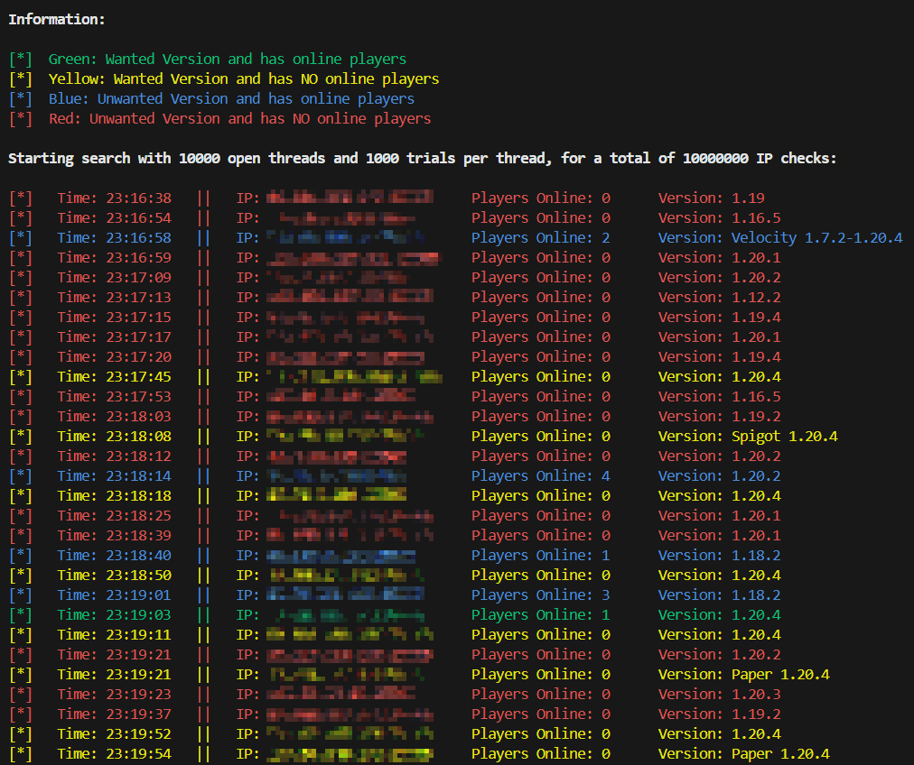

# Description
A little python script for searching the internet for minecraft servers.

# Library Dependencies
mcstatus and termcolor python libraries. To install run:
`python3 -m pip install mcstatus`
`python3 -m pip install --upgrade termcolor`

# How it works
The program generates random IPs and tries to connect to them using the mcstatus library. Once a connection is established, the information about the server is displayed on console.

# Editing Parameters
When you open the python file, you can edit the following parameters:
- threads: edit this number for the amount of threads used in the application.
- port: usually 25565, but you can edit it to whatever you wish.
- trials: How many IPs are going to be tested by each thread.
- wanted_versions: A list of minecraft versions for server categorization.

# Running the Program
To run the program, simply run, in the program's directory:
`python3 mc_server_finder.py`

